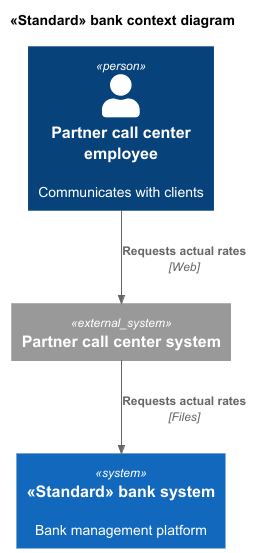
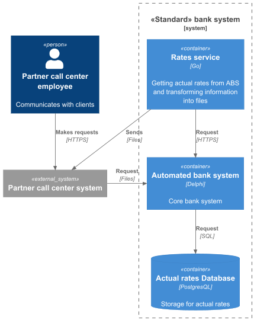

### **Название задачи: Передача ставок в кол-центр**

### **Автор: В.П.Девятайкин**

### **Дата: 06.03.2026**

### **Функциональные требования**

| **№** | **Действующие лица или системы**                                           | **Use Case**                               | **Описание**                                                                                                                                                                                                                                                                 |
|:-----:|:---------------------------------------------------------------------------|:-------------------------------------------|:-----------------------------------------------------------------------------------------------------------------------------------------------------------------------------------------------------------------------------------------------------------------------------|
|  UC1  | Сотрудник партнёрского кол-центра, Система партнёрского кол-центра, Клиент | Получение информации об актуальных ставках | 1. Сотрудник партнёрского кол-центра получает запрос от клиента об актуальных ставках   2. Сотрудник партнёрского кол-центра получает из системы кол-центра актуальные ставки   3. Сотрудник партнёрского кол-центра передаёт клиенту информацию об актуальных ставках |
|  UC2  | Система партнёрского кол-центра, Банк                                      | Запрос актуальных ставок                   | 1. Система партнёрского кол-центра запрашивает актуальные ставки   2. Менеджер бэк-офиса передаёт файл с актуальными ставками                                                                                                                                             |

### **Нефункциональные требования**

| **№** | **Требование**                                                                              |
|:-----:|:--------------------------------------------------------------------------------------------|
|   R   | Надёжность (Reliability)                                                                    |
|  R1   | Передача информации об актуальных ставках по безопасным каналам с использованием шифрования |
|   P   | Производительность (Performance)                                                            |
|  P1   | Минимальная задержка между запросом информации и её получением                              |
|   S   | Поддерживаемость (Supportability)                                                           |
|  S1   | Согласовать формат файлов                                                                   |
|  +R   | Ограничения (Restrictions)                                                                  |
|  +R1  | Получение актуальных ставок в виде файлов                                                   |
|  +R2  | Нет возможности сделать API-вызовы (например, через SFTP-протокол)                          |
|  +R3  | Решение должно быть реализовано на основе текущего процесса работы со ставками              |

### **Решение**

Диаграммы контекста и контейнеров в модели C4:
 
 

В настоящее время будет использоваться простой микросервис, который получает данные из АБС, преобразует их в файл и передаёт по безопасным каналам

### **Альтернативы**

Можно использовать брокер сообщений или Rest API, но в текущий момент система партнёрского кол-центра не поддерживает подобные взаимодействия

**Недостатки, ограничения, риски**

- Низкая скорость передачи информации об актуальных ставках
- Вероятность отправки устаревшей информации из-за отсутствия системы проверки

