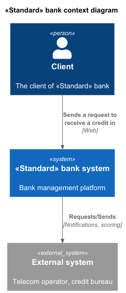
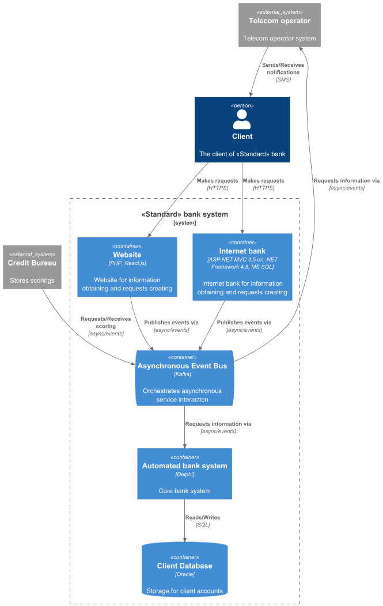

### **Название задачи: Заявка на кредит онлайн**

### **Автор: В.П.Девятайкин**

### **Дата: 07.03.2026**

### **Функциональные требования**

| **№** | **Действующие лица или системы** | **Use Case**     | **Описание**                                                                                                                                                                                                                                                                                                                                    |
|:-----:|:---------------------------------|:-----------------|:------------------------------------------------------------------------------------------------------------------------------------------------------------------------------------------------------------------------------------------------------------------------------------------------------------------------------------------------|
|  UC1  | Клиент, Сайт                     | Подача заявки    | 1. Клиент видит на сайте предложение открыть кредит по некоторой ставке   2. Клиент может подать заявку, оставив свой номер телефона и Ф. И. О.   3. Если клиент ещё заполнит паспортные данные, то ему сразу выдается решение об одобрении или неодобрении кредита   4. Клиент узнает по СМС об изменении статуса заявки на кредит    |
|  UC2  | Клиент, Интернет-банк            | Подача заявки    | 1. В интернет-банке клиент видит список доступных кредитов с актуальными условиями   2. Клиенту может выводиться предодобренное предложение по кредиту, это означает, что по клиенту в какой-то момент уже произошел скоринг и была рассчитана приемлемая сумма кредита   3. Операция на подачу заявки на кредит подтверждается СМС-кодом |
|  UC3  | Менеджер в бэк-офисе, АБС банка  | Обработка заявки | 1. Менеджер видит заявку в АБС   2. Если предложение предодобрено, то обработка происходит быстрее   3. Если заявка полностью новая, то запрашивается скоринг                                                                                                                                                                             |

### **Нефункциональные требования**

| **№** | **Требование**                                                                                                                                        |
|:-----:|:------------------------------------------------------------------------------------------------------------------------------------------------------|
|   R   | Надёжность (Reliability)                                                                                                                              |
|  R1   | Данные сайта необходимо защищать с помощью механизма шифрования трафика                                                                               |
|  R2   | В интернет-банке данные при передаче надо защитить каким-то механизмом шифрования                                                                     |
|  R3   | Иметь резервный ЦОД, в случае сбоя можно переключиться на него                                                                                        |
|   P   | Производительность (Performance)                                                                                                                      |
|  P1   | Отклик по всем операциям должен быть максимально быстрым и занимать миллисекунды                                                                      |
|   S   | Поддерживаемость (Supportability)                                                                                                                     |
|  S1   | Предусмотреть равномерное горизонтальное масштабирование и распределение запросов между серверами, приложениями и ЦОД                                 |
|  S1   | Учитывать возможный рост нагрузки и поддерживать горизонтальное масштабирование с работой 24/7                                                        |
|  +R   | + Ограничения (Restrictions)                                                                                                                          |
|  +R1  | Для очереди сообщений использовать Kafka                                                                                                              |
|  +R2  | Система кредитного скоринга испытывает повышенную нагрузку в рабочие часы, её не нужно нагружать дополнительными процессами по предрасчетам скорингов |

### **Решение**

Диаграммы контекста и контейнеров в модели C4:
 
 

В ходе принятия решений и выбора технологий я руководствовался следующей логикой:
Kafka облегчит взаимодействие с сайтом, интернет-банком и телеком-оператором, являясь при этом рекомендованной технологией.
Одним из требований является то, что при доработках во всех системах нужно как можно больше использовать технологии, которые уже есть в банке, поэтому сервисы унаследовали технологии от существующей системы.

### **Альтернативы**

Можно обойтись без использования брокера сообщений, но это повысит вероятность сбоев.

**Недостатки, ограничения, риски**

- Необходимо, чтобы все разработчики обладали знаниями и опытом в области использования брокеров сообщений
- Необходимость интеграции взаимодействия с брокером сообщений под разные технологии
- Большое количество legacy-кода, что будет затруднять onboarding новых сотрудников

